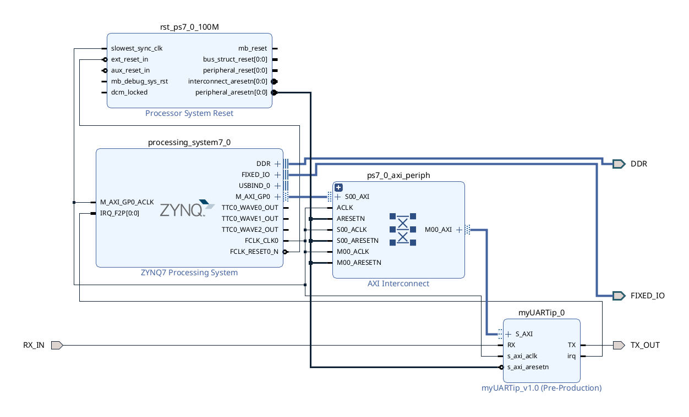

This is a simple custom UART receiver/transmitter module written in VHDL for the Zedboard programmable logic (FPGA). It runs at 19200 baud rate, with 1 stop bit and no parity bits. It uses the AXI4-Lite bus to interface with the Zedboard processing system (ARM CPU) as a memory mapped device.

The project also includes a Linux driver module and a wrapper file which redirects STDIN/STDOUT to /dev/myuart. There's also a game selection menu written in ncurses which executes a curated list of open source games from around the web.

This was tested on a VT510 hardware terminal (on VT100 emulation mode and 19200 baud rate).

Contents:
- linux_driver/
  - myuart.c: Linux driver module
- linux_user_apps/
  - myuart_run.c: wrapper file used to run any executable with /dev/myuart as STDIN/STDOUT
  - gameselection.c: ncurses game selection menu
- myUARTip_1.0/: Zynq UART AXI4-Lite IP created in Vivado
  - src/: VHDL source files for the UART module
  - hdl/: AXI4-Lite wrappers
- vitis_application/: test application written in Vitis for running on baremetal Zedboard (without Linux)
- vt100-patched.src: terminfo file for the VT510 terminal (on VT100 emulation mode) that adds cursor visibilty
- systemz_wrapper.xsa: XSA hardware file exported from Vivado from this block design:

